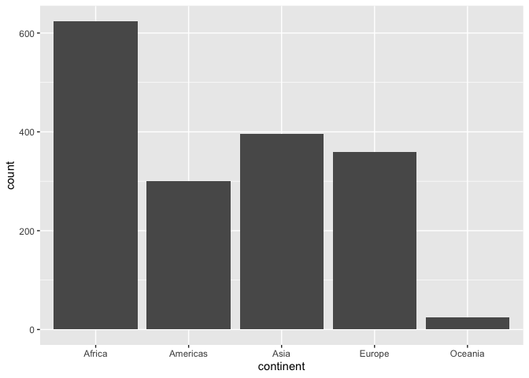
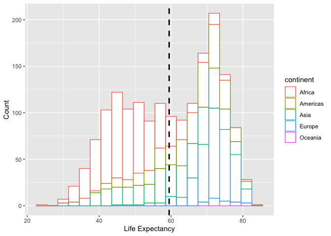

Homework 2 : Exercise 2
================
Elyse Adamic

## Exercise 2: Exploring Variables

### Categorical Variable: Continent

A list of possible values and an overall bar graph:

``` r
gapminder$continent %>% 
  levels()
```

    ## [1] "Africa"   "Americas" "Asia"     "Europe"   "Oceania"

``` r
gapminder %>% 
  ggplot(aes(continent)) +
  geom_bar()
```

<!-- -->

Count observations per continent:

``` r
count(gapminder,vars = continent)
```

    ## # A tibble: 5 x 2
    ##   vars         n
    ##   <fct>    <int>
    ## 1 Africa     624
    ## 2 Americas   300
    ## 3 Asia       396
    ## 4 Europe     360
    ## 5 Oceania     24

``` r
# tabulate(gapminder$continent) another less ideal way- does not show names
```

Count countries per continent:

``` r
gapminder %>% 
  select(continent,country) %>% 
  distinct() %>% 
  count(vars = continent)
```

    ## # A tibble: 5 x 2
    ##   vars         n
    ##   <fct>    <int>
    ## 1 Africa      52
    ## 2 Americas    25
    ## 3 Asia        33
    ## 4 Europe      30
    ## 5 Oceania      2

Which countries are in Oceania?

``` r
gapminder %>% 
  filter(continent=="Oceania") %>% 
  count(vars = country)
```

    ## # A tibble: 2 x 2
    ##   vars            n
    ##   <fct>       <int>
    ## 1 Australia      12
    ## 2 New Zealand    12

### Quantitative Variable: lifeExp

Basic Summaries:

``` r
gapminder$lifeExp %>% 
  summary()
```

    ##    Min. 1st Qu.  Median    Mean 3rd Qu.    Max. 
    ##   23.60   48.20   60.71   59.47   70.85   82.60

``` r
# We can subset to summarize for a specific year or country:
summary(subset(gapminder, year==2007)$lifeExp)
```

    ##    Min. 1st Qu.  Median    Mean 3rd Qu.    Max. 
    ##   39.61   57.16   71.94   67.01   76.41   82.60

``` r
summary(subset(gapminder, country == "Canada")$lifeExp)
```

    ##    Min. 1st Qu.  Median    Mean 3rd Qu.    Max. 
    ##   68.75   71.92   74.98   74.90   78.11   80.65

``` r
# Summarize Canada by year
canada <- subset(gapminder,country == "Canada")
with(canada,tapply(lifeExp,year,mean))
```

    ##   1952   1957   1962   1967   1972   1977   1982   1987   1992   1997 
    ## 68.750 69.960 71.300 72.130 72.880 74.210 75.760 76.860 77.950 78.610 
    ##   2002   2007 
    ## 79.770 80.653

``` r
# Summarize by continent year
with(gapminder,tapply(lifeExp,list(year,continent),mean))
```

    ##        Africa Americas     Asia   Europe Oceania
    ## 1952 39.13550 53.27984 46.31439 64.40850 69.2550
    ## 1957 41.26635 55.96028 49.31854 66.70307 70.2950
    ## 1962 43.31944 58.39876 51.56322 68.53923 71.0850
    ## 1967 45.33454 60.41092 54.66364 69.73760 71.3100
    ## 1972 47.45094 62.39492 57.31927 70.77503 71.9100
    ## 1977 49.58042 64.39156 59.61056 71.93777 72.8550
    ## 1982 51.59287 66.22884 62.61794 72.80640 74.2900
    ## 1987 53.34479 68.09072 64.85118 73.64217 75.3200
    ## 1992 53.62958 69.56836 66.53721 74.44010 76.9450
    ## 1997 53.59827 71.15048 68.02052 75.50517 78.1900
    ## 2002 53.32523 72.42204 69.23388 76.70060 79.7400
    ## 2007 54.80604 73.60812 70.72848 77.64860 80.7195

``` r
subset(gapminder, country == "Canada")
```

    ## # A tibble: 12 x 6
    ##    country continent  year lifeExp      pop gdpPercap
    ##    <fct>   <fct>     <int>   <dbl>    <int>     <dbl>
    ##  1 Canada  Americas   1952    68.8 14785584    11367.
    ##  2 Canada  Americas   1957    70.0 17010154    12490.
    ##  3 Canada  Americas   1962    71.3 18985849    13462.
    ##  4 Canada  Americas   1967    72.1 20819767    16077.
    ##  5 Canada  Americas   1972    72.9 22284500    18971.
    ##  6 Canada  Americas   1977    74.2 23796400    22091.
    ##  7 Canada  Americas   1982    75.8 25201900    22899.
    ##  8 Canada  Americas   1987    76.9 26549700    26627.
    ##  9 Canada  Americas   1992    78.0 28523502    26343.
    ## 10 Canada  Americas   1997    78.6 30305843    28955.
    ## 11 Canada  Americas   2002    79.8 31902268    33329.
    ## 12 Canada  Americas   2007    80.7 33390141    36319.

``` r
# Country with highest and lowest life expectancy in the data
gapminder[which.max(gapminder$lifeExp),]
```

    ## # A tibble: 1 x 6
    ##   country continent  year lifeExp       pop gdpPercap
    ##   <fct>   <fct>     <int>   <dbl>     <int>     <dbl>
    ## 1 Japan   Asia       2007    82.6 127467972    31656.

``` r
gapminder[which.min(gapminder$lifeExp),]
```

    ## # A tibble: 1 x 6
    ##   country continent  year lifeExp     pop gdpPercap
    ##   <fct>   <fct>     <int>   <dbl>   <int>     <dbl>
    ## 1 Rwanda  Africa     1992    23.6 7290203      737.

A histogram:

``` r
hist <- ggplot (gapminder, aes(x = lifeExp, color = continent)) +
  geom_histogram(fill = "white", binwidth = 3) +
  xlab("Life Expectancy") +
  ylab("Count")

hist + geom_vline(aes(xintercept=mean(lifeExp)),
            color="black", linetype="dashed", size=1)
```

<!-- -->
