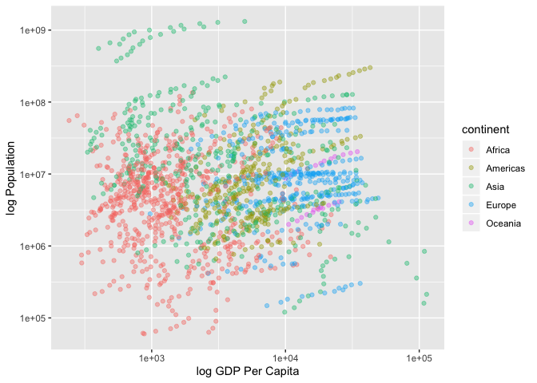
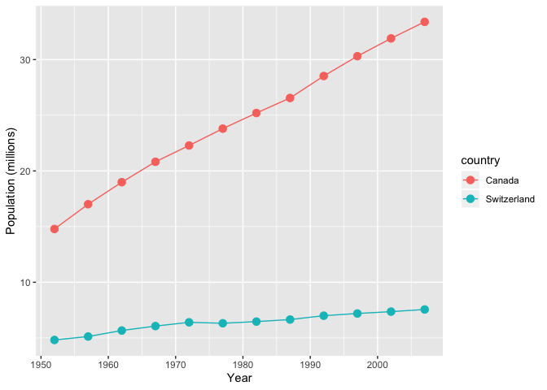

## Exercise 3: Exploring Plot Types
### Scatterplot: gdpPerCap vs. Population


```r
ggplot(gapminder, aes(gdpPercap, pop, group = continent, color = continent)) +
  scale_x_log10() +
  scale_y_log10() +
  geom_point(alpha = 0.4) +
  xlab("log GDP Per Capita") +
  ylab("log Population")
```

<!-- -->

### Line Graph: population growth over time for Canada and Switzerland

```r
gapminder %>% 
  mutate(pop_mil = pop/1000000) %>% 
  filter(country == "Canada" | country == "Switzerland") %>% 
  ggplot(aes(x = year, y = pop_mil, group = country, color = country)) + 
  geom_line() + geom_point(size=3) + xlab("Year") + ylab("Population (millions)")
```

<!-- -->

### Optional: Recycling

```r
filter(gapminder, country == c("Rwanda", "Afghanistan"))
```

```
## # A tibble: 12 x 6
##    country     continent  year lifeExp      pop gdpPercap
##    <fct>       <fct>     <int>   <dbl>    <int>     <dbl>
##  1 Afghanistan Asia       1957    30.3  9240934      821.
##  2 Afghanistan Asia       1967    34.0 11537966      836.
##  3 Afghanistan Asia       1977    38.4 14880372      786.
##  4 Afghanistan Asia       1987    40.8 13867957      852.
##  5 Afghanistan Asia       1997    41.8 22227415      635.
##  6 Afghanistan Asia       2007    43.8 31889923      975.
##  7 Rwanda      Africa     1952    40    2534927      493.
##  8 Rwanda      Africa     1962    43    3051242      597.
##  9 Rwanda      Africa     1972    44.6  3992121      591.
## 10 Rwanda      Africa     1982    46.2  5507565      882.
## 11 Rwanda      Africa     1992    23.6  7290203      737.
## 12 Rwanda      Africa     2002    43.4  7852401      786.
```
The analyst did not succeed, as they did not get all observations for the two countries of interest. This is because of recycling and the problem that we are evaluating objects of two different lengths. Essentially, R is taking ``` c("Rwanda", "Afghanistan") ``` and repeating this to evaluate if ``` country[1] == "Rwanda", country[2] == "Afghanistan", country[3] == "Rwanda"...``` and pulling the observations which return "TRUE" for the entire legnth of gapminder. In this way, you are getting every second of each Afghanistan and Rwanda's observations. There are many differnt correct ways to do this:


```r
gapminder %>% 
filter(country == "Rwanda" | country == "Afghanistan")
```

```
## # A tibble: 24 x 6
##    country     continent  year lifeExp      pop gdpPercap
##    <fct>       <fct>     <int>   <dbl>    <int>     <dbl>
##  1 Afghanistan Asia       1952    28.8  8425333      779.
##  2 Afghanistan Asia       1957    30.3  9240934      821.
##  3 Afghanistan Asia       1962    32.0 10267083      853.
##  4 Afghanistan Asia       1967    34.0 11537966      836.
##  5 Afghanistan Asia       1972    36.1 13079460      740.
##  6 Afghanistan Asia       1977    38.4 14880372      786.
##  7 Afghanistan Asia       1982    39.9 12881816      978.
##  8 Afghanistan Asia       1987    40.8 13867957      852.
##  9 Afghanistan Asia       1992    41.7 16317921      649.
## 10 Afghanistan Asia       1997    41.8 22227415      635.
## # … with 14 more rows
```

```r
# Note this also works:
#filter(gapminder, country %in% c("Rwanda", "Afghanistan"))
```

### Optional: Improving Tibble Display
**Note: these are only good for html_documents, I rendered as a .md for the sake of github**

This is a small tibble:
```
gapminder %>% 
  select(country:pop) %>% 
  filter(country == "Canada") %>% 
  knitr::kable()
```

This is a big tibble:
```
gapminder %>% 
  select(country:pop) %>% 
  DT::datatable()
```

