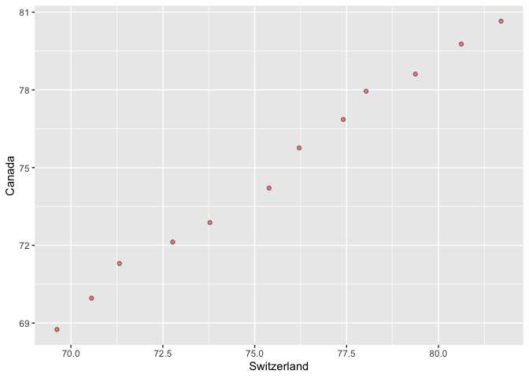

### Exercise 1: Univariate Pivoting
1) Put data in wider format.
2) Produce a plot of the wide data.
3) Re-lengthen the wider data. 

Option 1: 
Make a tibble with one row per year, and columns for life expectancy for two or more countries. Note when we put the data into wider format, we lose the other variables in the dataset so the select isn't actually needed. Also we have no way to recover these when pivoting back to long format. 


```r
(wide_uni <- gapminder %>% 
  filter(country == "Canada"| country ==  "Switzerland"| country == "United States") %>% 
  select(country, year, lifeExp) %>% 
  pivot_wider(id_cols = year,
              names_from = country,
              values_from = lifeExp))
```

```
## # A tibble: 12 x 4
##     year Canada Switzerland `United States`
##    <int>  <dbl>       <dbl>           <dbl>
##  1  1952   68.8        69.6            68.4
##  2  1957   70.0        70.6            69.5
##  3  1962   71.3        71.3            70.2
##  4  1967   72.1        72.8            70.8
##  5  1972   72.9        73.8            71.3
##  6  1977   74.2        75.4            73.4
##  7  1982   75.8        76.2            74.6
##  8  1987   76.9        77.4            75.0
##  9  1992   78.0        78.0            76.1
## 10  1997   78.6        79.4            76.8
## 11  2002   79.8        80.6            77.3
## 12  2007   80.7        81.7            78.2
```

```r
wide_uni %>% 
  ggplot(aes(Switzerland,Canada)) +
    geom_point(shape = 21, fill = "red", alpha = 0.5)
```

<!-- -->

```r
wide_uni %>% 
  pivot_longer(cols = c("Canada", "Switzerland", "United States" ),
               names_to = "country",
               values_to = "LifeExp") %>% 
  arrange(country, year)
```

```
## # A tibble: 36 x 3
##     year country LifeExp
##    <int> <chr>     <dbl>
##  1  1952 Canada     68.8
##  2  1957 Canada     70.0
##  3  1962 Canada     71.3
##  4  1967 Canada     72.1
##  5  1972 Canada     72.9
##  6  1977 Canada     74.2
##  7  1982 Canada     75.8
##  8  1987 Canada     76.9
##  9  1992 Canada     78.0
## 10  1997 Canada     78.6
## # … with 26 more rows
```

### Exercise 2: Multivariate Pivoting
1) Put data in wider format.
3) Re-lengthen the wider data. 

Option 1: Make a tibble with one row per year, and columns for life expectancy and GDP per capita (or two other numeric variables) for two or more countries. Note here we want to "retain column status" so we use the ".value" and we do not need a values_to. 


```r
(wide_multi <- gapminder %>% 
  filter(country == "Canada"| country ==  "Switzerland") %>% 
  pivot_wider(id_cols = year,
              names_from = country,
              names_sep   = "_",
              values_from = c(lifeExp, gdpPercap)))
```

```
## # A tibble: 12 x 5
##     year lifeExp_Canada lifeExp_Switzerl… gdpPercap_Canada gdpPercap_Switz…
##    <int>          <dbl>             <dbl>            <dbl>            <dbl>
##  1  1952           68.8              69.6           11367.           14734.
##  2  1957           70.0              70.6           12490.           17909.
##  3  1962           71.3              71.3           13462.           20431.
##  4  1967           72.1              72.8           16077.           22966.
##  5  1972           72.9              73.8           18971.           27195.
##  6  1977           74.2              75.4           22091.           26982.
##  7  1982           75.8              76.2           22899.           28398.
##  8  1987           76.9              77.4           26627.           30282.
##  9  1992           78.0              78.0           26343.           31872.
## 10  1997           78.6              79.4           28955.           32135.
## 11  2002           79.8              80.6           33329.           34481.
## 12  2007           80.7              81.7           36319.           37506.
```

```r
(wide_multi %>% 
  pivot_longer(cols = c(-year),
               names_to = c(".value","country"),
               names_sep = "_",) %>% 
  arrange(country, year))
```

```
## # A tibble: 24 x 4
##     year country lifeExp gdpPercap
##    <int> <chr>     <dbl>     <dbl>
##  1  1952 Canada     68.8    11367.
##  2  1957 Canada     70.0    12490.
##  3  1962 Canada     71.3    13462.
##  4  1967 Canada     72.1    16077.
##  5  1972 Canada     72.9    18971.
##  6  1977 Canada     74.2    22091.
##  7  1982 Canada     75.8    22899.
##  8  1987 Canada     76.9    26627.
##  9  1992 Canada     78.0    26343.
## 10  1997 Canada     78.6    28955.
## # … with 14 more rows
```

### Exercise 3: Table Joins


#### 3.1
For each guest in the guestlist (guest tibble), add a column for email address, which can be found in the email tibble.

- this will be a mutating join since we want a new variable 
- this will be a left outer join and guestlist is our "main" tibble

We first had to separate email_name and rename guest so there was a common variable to join by, note also the space after the comma was needed here for separating, or else names woudl not match. Another way would be to define an index for party in email 


```r
email_name <- email %>% 
  separate_rows(guest, sep = ", ") %>% 
  rename(name = guest)

guest %>% 
  left_join(email_name,
            by = "name")
```

```
## # A tibble: 30 x 8
##    party name  meal_wedding meal_brunch attendance_wedd… attendance_brun…
##    <dbl> <chr> <chr>        <chr>       <chr>            <chr>           
##  1     1 Somm… PENDING      PENDING     PENDING          PENDING         
##  2     1 Phil… vegetarian   Menu C      CONFIRMED        CONFIRMED       
##  3     1 Blan… chicken      Menu A      CONFIRMED        CONFIRMED       
##  4     1 Emaa… PENDING      PENDING     PENDING          PENDING         
##  5     2 Blai… chicken      Menu C      CONFIRMED        CONFIRMED       
##  6     2 Nige… <NA>         <NA>        CANCELLED        CANCELLED       
##  7     3 Sine… PENDING      PENDING     PENDING          PENDING         
##  8     4 Ayra… vegetarian   Menu B      PENDING          PENDING         
##  9     5 Atla… PENDING      PENDING     PENDING          PENDING         
## 10     5 Denz… fish         Menu B      CONFIRMED        CONFIRMED       
## # … with 20 more rows, and 2 more variables: attendance_golf <chr>,
## #   email <chr>
```

#### 3.2
Who do we have emails for, yet are not on the guestlist?
- start with email, antijoin guest


```r
email_name %>% 
  anti_join(guest,
            by = "name")
```

```
## # A tibble: 3 x 2
##   name            email                          
##   <chr>           <chr>                          
## 1 Turner Jones    tjjones12@hotmail.ca           
## 2 Albert Marshall themarshallfamily1234@gmail.com
## 3 Vivian Marshall themarshallfamily1234@gmail.com
```

#### 3.3
Make a guestlist that includes everyone we have emails for (in addition to those on the original guestlist).

- check: this should be 33 rows long


```r
guest %>% 
  full_join(email_name,
            by = "name") %>% 
  DT::datatable()
```

<!--html_preserve--><div id="htmlwidget-153bbb57fafb96a14f64" style="width:100%;height:auto;" class="datatables html-widget"></div>
<script type="application/json" data-for="htmlwidget-153bbb57fafb96a14f64">{"x":{"filter":"none","data":[["1","2","3","4","5","6","7","8","9","10","11","12","13","14","15","16","17","18","19","20","21","22","23","24","25","26","27","28","29","30","31","32","33"],[1,1,1,1,2,2,3,4,5,5,5,6,6,7,7,8,9,10,11,12,12,12,12,12,13,13,14,14,15,15,null,null,null],["Sommer Medrano","Phillip Medrano","Blanka Medrano","Emaan Medrano","Blair Park","Nigel Webb","Sinead English","Ayra Marks","Atlanta Connolly","Denzel Connolly","Chanelle Shah","Jolene Welsh","Hayley Booker","Amayah Sanford","Erika Foley","Ciaron Acosta","Diana Stuart","Cosmo Dunkley","Cai Mcdaniel","Daisy-May Caldwell","Martin Caldwell","Violet Caldwell","Nazifa Caldwell","Eric Caldwell","Rosanna Bird","Kurtis Frost","Huma Stokes","Samuel Rutledge","Eddison Collier","Stewart Nicholls","Turner Jones","Albert Marshall","Vivian Marshall"],["PENDING","vegetarian","chicken","PENDING","chicken",null,"PENDING","vegetarian","PENDING","fish","chicken",null,"vegetarian",null,"PENDING","PENDING","vegetarian","PENDING","fish","chicken","PENDING","PENDING","chicken","chicken","vegetarian","PENDING",null,"chicken","PENDING","chicken",null,null,null],["PENDING","Menu C","Menu A","PENDING","Menu C",null,"PENDING","Menu B","PENDING","Menu B","Menu C",null,"Menu C","PENDING","PENDING","Menu A","Menu C","PENDING","Menu C","Menu B","PENDING","PENDING","PENDING","Menu B","Menu C","PENDING",null,"Menu C","PENDING","Menu B",null,null,null],["PENDING","CONFIRMED","CONFIRMED","PENDING","CONFIRMED","CANCELLED","PENDING","PENDING","PENDING","CONFIRMED","CONFIRMED","CANCELLED","CONFIRMED","CANCELLED","PENDING","PENDING","CONFIRMED","PENDING","CONFIRMED","CONFIRMED","PENDING","PENDING","PENDING","CONFIRMED","CONFIRMED","PENDING","CANCELLED","CONFIRMED","PENDING","CONFIRMED",null,null,null],["PENDING","CONFIRMED","CONFIRMED","PENDING","CONFIRMED","CANCELLED","PENDING","PENDING","PENDING","CONFIRMED","CONFIRMED","CANCELLED","CONFIRMED","PENDING","PENDING","PENDING","CONFIRMED","PENDING","CONFIRMED","CONFIRMED","PENDING","PENDING","PENDING","CONFIRMED","CONFIRMED","PENDING","CANCELLED","CONFIRMED","PENDING","CONFIRMED",null,null,null],["PENDING","CONFIRMED","CONFIRMED","PENDING","CONFIRMED","CANCELLED","PENDING","PENDING","PENDING","CONFIRMED","CONFIRMED","CANCELLED","CONFIRMED","PENDING","PENDING","PENDING","CONFIRMED","PENDING","CONFIRMED","CONFIRMED","PENDING","PENDING","PENDING","CONFIRMED","CONFIRMED","PENDING","CANCELLED","CONFIRMED","PENDING","CONFIRMED",null,null,null],["sommm@gmail.com","sommm@gmail.com","sommm@gmail.com","sommm@gmail.com","bpark@gmail.com","bpark@gmail.com","singlish@hotmail.ca","marksa42@gmail.com",null,null,null,"jw1987@hotmail.com","jw1987@hotmail.com","erikaaaaaa@gmail.com","erikaaaaaa@gmail.com","shining_ciaron@gmail.com","doodledianastu@gmail.com",null,null,"caldwellfamily5212@gmail.com","caldwellfamily5212@gmail.com","caldwellfamily5212@gmail.com","caldwellfamily5212@gmail.com","caldwellfamily5212@gmail.com","rosy1987b@gmail.com","rosy1987b@gmail.com","humastokes@gmail.com","humastokes@gmail.com","eddison.collier@gmail.com","eddison.collier@gmail.com","tjjones12@hotmail.ca","themarshallfamily1234@gmail.com","themarshallfamily1234@gmail.com"]],"container":"<table class=\"display\">\n  <thead>\n    <tr>\n      <th> <\/th>\n      <th>party<\/th>\n      <th>name<\/th>\n      <th>meal_wedding<\/th>\n      <th>meal_brunch<\/th>\n      <th>attendance_wedding<\/th>\n      <th>attendance_brunch<\/th>\n      <th>attendance_golf<\/th>\n      <th>email<\/th>\n    <\/tr>\n  <\/thead>\n<\/table>","options":{"columnDefs":[{"className":"dt-right","targets":1},{"orderable":false,"targets":0}],"order":[],"autoWidth":false,"orderClasses":false}},"evals":[],"jsHooks":[]}</script><!--/html_preserve-->
